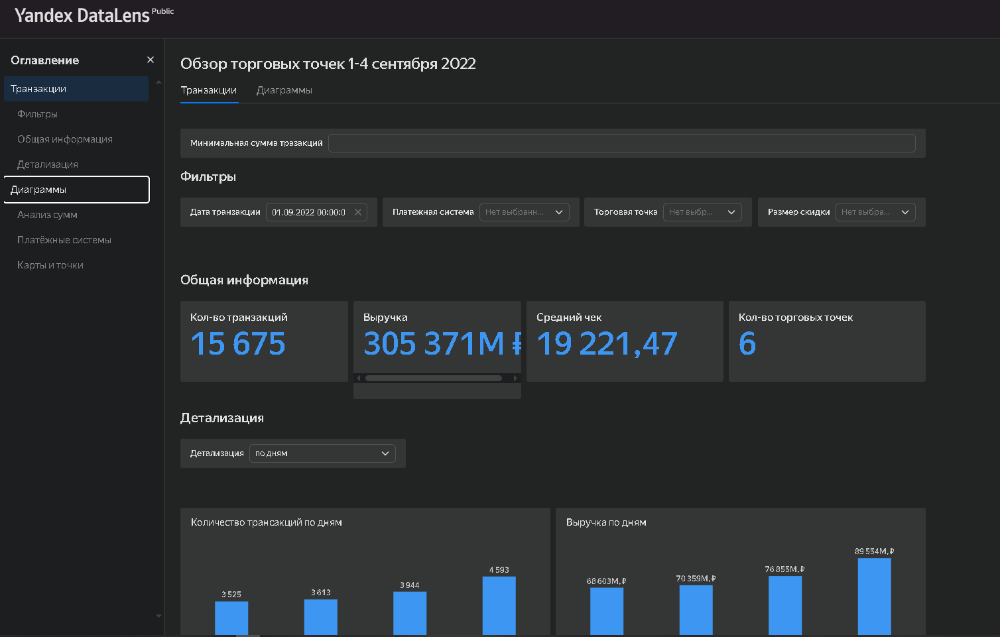

# 🏪 SkyCrossroads — аналитика розничной сети

Анализ транзакций сети розничных магазинов **SkyCrossroads**: операционные аномалии, эффект маркетинговой акции на выручку и средний чек, эффективность торговых точек. Аналитика — в **Excel / Google Sheets**, визуализация — интерактивный дашборд в **Yandex DataLens**.

<!-- РЕКОМЕНДАЦИЯ: добавь скриншот дашборда — это главный «крючок» для рекрутера.
     Положи PNG в assets/ и раскомментируй строку ниже: -->
<!--  -->

## ▶️ Живой дашборд
**[Открыть интерактивный дашборд в Yandex DataLens](https://datalens.yandex/0barom92n5igk)**

## 🎯 Бизнес-вопросы
- Какова общая выручка и количество транзакций за период?
- Как меняется активность покупателей по дням?
- Какие торговые точки наиболее эффективны?
- Как скидки и маркетинговая акция влияют на выручку и средний чек?
- Есть ли операционные аномалии (по длительности операций)?

## 🗃 О данных
- Транзакции розничной сети: **15 675** покупок по **6** торговым точкам.
- Ключевые поля: дата, торговая точка, платёжная система, сумма покупки, скидка, длительность операции.
<!-- TODO: укажи период данных (с … по …). -->

## 🛠 Что было сделано
1. Проанализировал транзакции сети и проверил качество данных.
2. Изучил длительность операций, **выявил и интерпретировал аномалии** с учётом бизнес-контекста.
3. Оценил **эффект маркетинговой акции** на выручку, прибыль и средний чек.
4. Рассчитал **коэффициенты прироста** и динамику ключевых метрик по периодам.
5. Исправил ошибки в отчёте-калькуляторе коллеги.
6. Построил интерактивные графики и дашборд (Google Sheets → Yandex DataLens).

## 🔍 Ключевые выводы

| Метрика | Значение |
|---|---|
| 💳 Транзакций за период | **15 675** |
| 🛒 Средний чек | **19 221 ₽** |
| 🏪 Торговых точек в сети | **6** (разная эффективность) |
| 📈 Рост выручки в период акции | **+30%** |

- 📈 В период промо-акции выручка выросла на **~30%** — акция сработала на выручку.
- 🏪 Торговые точки заметно различаются по выручке и среднему чеку — есть лидеры и отстающие.
- 🧾 Разбивка по платёжным системам и скидкам показывает структуру спроса.
- ⚠️ По длительности операций выявлены аномалии — интерпретированы с учётом бизнес-контекста.

## 🧱 Структура дашборда
- **KPI-карточки** — выручка, транзакции, средний чек, кол-во точек.
- **Фильтры** — дата, платёжная система, торговая точка, скидка.
- **Динамика по дням** — транзакции и выручка.
- **Сравнение торговых точек** — детализация по локациям.
- **Текстовые выводы** — интерпретация каждого графика.

## 🧰 Инструменты
| Инструмент | Применение |
|---|---|
| **Excel / Google Sheets** | Анализ транзакций, функции QUERY, сводные таблицы |
| **Yandex DataLens** | Дашборд, KPI-карточки, интерактивные фильтры |

## 📎 Материалы
- 📄 [Аналитический отчёт (PDF)](assets/skycrossroads-report.pdf)
- 📊 [Презентация (Google Slides)](https://docs.google.com/presentation/d/1l0o3rGptSjXWapfw-gVg1xFuPse7X4RZ/edit?usp=sharing)

## 🧠 Что демонстрирует кейс
- Работа с транзакционными данными: агрегации, метрики, аномалии.
- Продуктовая интерпретация: средний чек, эффект акции, сравнение точек.
- BI-разработка: интерактивный дашборд в DataLens.

## 👤 Автор
**Вячеслав Тихомиров** — BI / Data Analyst
📧 t-slava@mail.ru · Telegram: [@tih_slava](https://t.me/tih_slava) · [GitHub](https://github.com/t-slava-pro)
